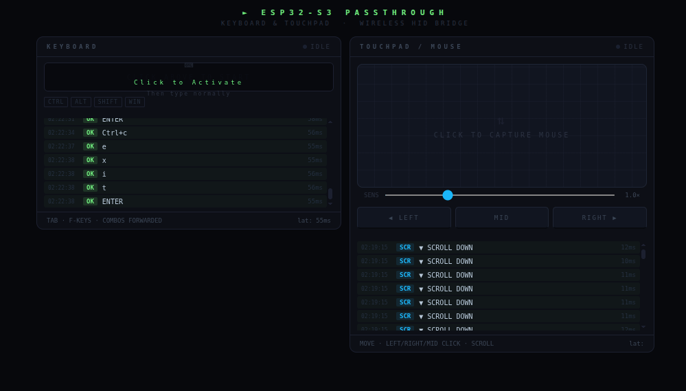

# ESP32-S3 WiFi HID Passthrough

Turn an ESP32-S3 into a wireless keyboard and mouse bridge. Type on your laptop and move its touchpad — every input is forwarded in real time to a PC via USB-HID.



---

## How It Works

```
Laptop browser  ──WiFi──▶  ESP32-S3 AP  ──USB-HID──▶  PC
  (type / move)              (192.168.4.1)             (receives input)
```

The ESP32-S3 hosts a WiFi access point and a web server. The browser page captures raw keyboard and pointer events and sends them over HTTP. The ESP32 replays them as a real USB keyboard and mouse on the PC it's plugged into.

---

## Features

- **Full keyboard passthrough** — every key, modifier combo (Ctrl+C, Alt+Tab, etc.), F-keys, and arrows
- **Touchpad passthrough** — smooth cursor movement via the Pointer Lock API, left / right / middle click, scroll wheel
- **Adjustable sensitivity** — slider from 0.2× to 3.3×
- **Live log** — per-keystroke and click log with round-trip latency
- **Modifier indicators** — Ctrl / Alt / Shift / Win highlight in real time
- **Lightweight UI** — entire page fits in ~6 KB of ESP32 flash, no SD card needed

---

## Requirements

| Item | Detail |
|------|--------|
| Board | ESP32-S3 (any dev board with USB-OTG) |
| Cable | USB-C data cable ESP32-S3 → PC |
| PlatformIO | VS Code + PlatformIO IDE extension |
| Browser | Chrome or Edge (Pointer Lock requires no HTTPS on local AP) |

---

## PlatformIO Setup

Add this `platformio.ini` to the root of your project:

```ini
[env:esp32-s3-devkitm-1]
platform = espressif32
board = esp32-s3-devkitm-1
framework = arduino

monitor_speed = 115200

; 🔥 IMPORTANT for USB HID
build_flags =
    -D ARDUINO_USB_MODE=1
    -D ARDUINO_USB_CDC_ON_BOOT=1

lib_deps =
```

No extra libraries needed — `USB`, `USBHIDKeyboard`, and `USBHIDMouse` are part of the ESP32 Arduino framework.

---

## Flash & Use

```bash
# 1. Build & flash (hold BOOT button if the board doesn't auto-reset)
pio run --target upload

# 2. Replug the USB-C cable into the PC  ← important, switches to HID mode
# 3. On the laptop, connect to WiFi:
#      SSID:     ESP32-KB
#      Password: 12345678
# 4. Open browser → http://192.168.4.1
```

- **Keyboard panel** — click the zone once, then type normally
- **Touchpad panel** — click the grid to lock the pointer, move and click freely; press `Esc` to release

---

## File Overview

```
├── src/
│   └── main.cpp          ← main source file
├── platformio.ini         ← board & build config
├── images/
│   └── dashboard.png
└── README.md
```

---

## Known Limitations

- OS-level shortcuts (`Ctrl+Alt+Del`, Win key on some systems) are blocked by the browser before they reach the page
- Firefox requires HTTPS for Pointer Lock; use Chrome or Edge on the local AP
- Latency is ~15–40 ms over WiFi — comfortable for general use, not for gaming